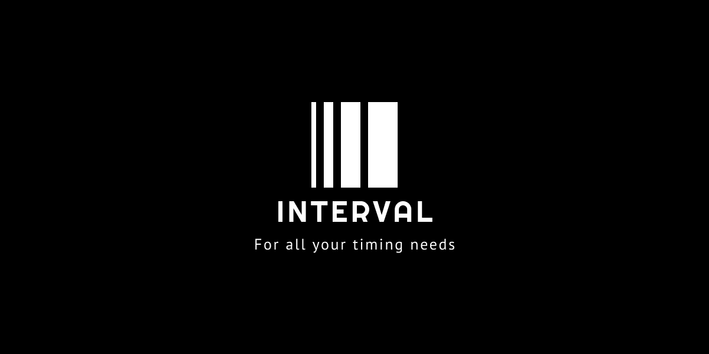
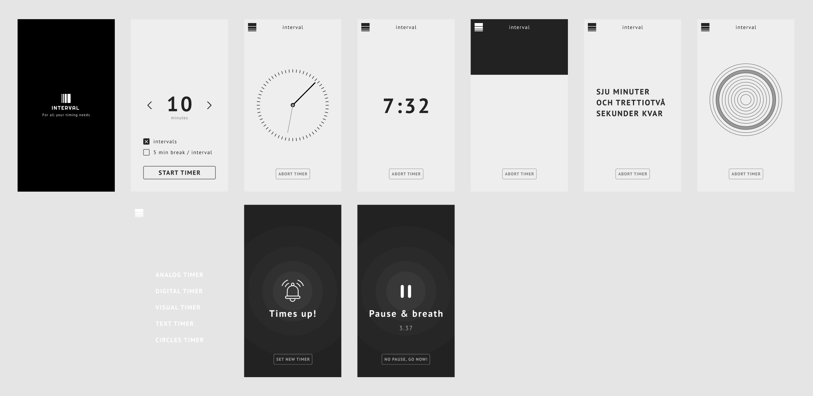

Anton Hansen, Johan Kristensson, Filip Isaksson och Hampus Falk


# Interval App - for all you timing needs

## Bakgrund
Förmågan att mäta tid är väldigt användbart. Från träning till studier är en bra timer guld värd.

Några användningsområden för en bra tidtagar-app är:

- [Timeboxing](https://medium.com/dreimannzelt-adventures/7-secrets-to-master-timeboxing-66a744ea9175)
- [Pomondoro metoden](https://www.metodbanken.se/post/pomodorometoden)
- [Parprogrammering](https://sv.wikipedia.org/wiki/Parprogrammering)


## Uppdragsbeskrivning
Ert uppdrag är att skapa en ultimata tidtagar-webbappen för mobiler. Den är enkel till sin funktion, men kan visa tid på flera olika sätt, se vybeskrivningar samt screens nedan. Bifogat finns även en Figmafil (```.fig```). 

Viss remix av utseende får göras, ex. lägga till färger, ändra fonter etc, dock skall funktionalitet vara densamma.


**Appen ska ha följande vyer:**

|Vy|Beskrivning|
|---|---|
|loading|en loading screen där endast logotyp samt slogan finns med. Du kommer vidare till *Set Timer* genom att klicka på logotypen.|
|set timer|Här ställer du in hur många minuter timern skall gå. Du anger också om timern ska gå i intervaller, d.v.s. starta om efter den nått 0. Valet att även lägga in en 5 minuters pause mellan varje intervall finns. Detta är väldigt användbart i ex. studiesyfte med [pomondoro metoden](https://www.metodbanken.se/post/pomodorometoden) alt. när man [parprogrammerar](https://sv.wikipedia.org/wiki/Parprogrammering). |
|analog timer|Här visas tiden med en analog urtavla där minut samt sekundvisaren rör sig. En knapp för att avbryta nuvarande timer och återgå till *set timer* skall finnas.|
|digital timer|Här visas tiden med en digital klocka som uppdateras varje sekund. En knapp för att avbryta nuvarande timer och återgå till *set timer* skall finnas.|
|visual timer|Här visualiseras att tiden minskar med ett bakgrundsblock ( tänk timglas) som minskar. Från att från början tagit upp hela skärmen skall den vid 0, försvinna i nedrekanten av skärmen. En knapp för att avbryta nuvarande timer och återgå till *set timer* skall finnas.|
|alarmvy|Denna vy visas när tiden är ute. En knapp för att gå till *set timer* skall finnas.|
|pausvy|Denna vy visas när tiden är ute och man valt paus mellan intervaller. En knapp för att avbryta pausen och starta timern igen skall finnas.|
|levelup-vyer|Se stycket om Level ups|

På samtliga timervyer skall en *meny-ikon* i hörnet visa en meny där användaren ska kunna växla mellan olika timer-vyer. Notera att dessa byten inte skall avbryta eller nollställa timern.


En interaktiv mockup hittar ni [här](https://www.figma.com/proto/AerBB2Yx3IiT9iL8U8akVR/Interval-app-1.0?node-id=23%3A176&scaling=scale-down&page-id=23%3A3).

## Tekniska krav
För att producera så stabil, säker och strukturerad kod som möjligt så ska er app kodas i [TypeScript](https://www.typescriptlang.org/) samt [SCSS](https://sass-lang.com/) för CSS. Tänk på att ni kan dela upp såväl er [TS](https://www.typescriptlang.org/docs/handbook/modules.html) som [SCSS](https://sass-lang.com/guide) i *moduler*.

Att jobba med tid i programmering kan snabbt bli väldigt komplext. Därför är det högst rekomenderat att använda ett bibliotek som underlättar just detta. Ex. [EasyTimer.js av Albert Gonzalez](https://albert-gonzalez.github.io/easytimer.js/).


## Arbetsmetod
Ni ska jobba i team om 3-4 pers. Gällande arbetsflödet kring koden skall git användas.

Ert projekt kommer inledas med att ni tillsammans i teamet granskar de tekniska krav samt vilka funktioner appen innehåller. Utifrån dessa skapar ni en lista med *features* som nedtecknas någonstans kollektivt, förslagsvis på [Trello](https://trello.com/).

En ur teamet skapar ett repo på github och bjuder in de andra som *collaborators*. Personen som skapar repot ansvarar även för att skapa en *develop* branch.

Varje medlem i teamet skall under projektet göra minst 1 (helst 2) egna *feature branches* som senare mergas in i *develop* och slutligen efter genemsam *code review* även in i *main*. Glöm inte att var flitig med commits.


## Level ups
Levelups kan man utmana sig med när Interval App är klar.

**Text timer**
Visa tiden med hjälp av skriven text.

**Circle Timer**
Visa tiden med hjälp av ringar som animeras utifrån och in, allt som tiden tickar ner. 1 ring per minut.

**Egna timervyer**
Visa tiden med egna timervyer.

## Bedömning
Det primära syftet är att träna och examinera er förmåga att jobba i enlighet med git, och git flow.

### För G
- Du har aktivt bidragit till ett färdigt projekt med TS och SCSS
- Du har deltagit aktivt i processen
- Du har jobbat med git och ansvarat för minst 1 feature branch

